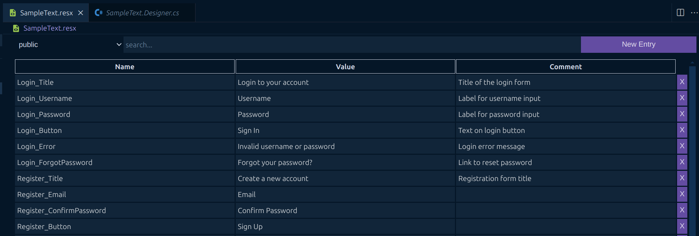
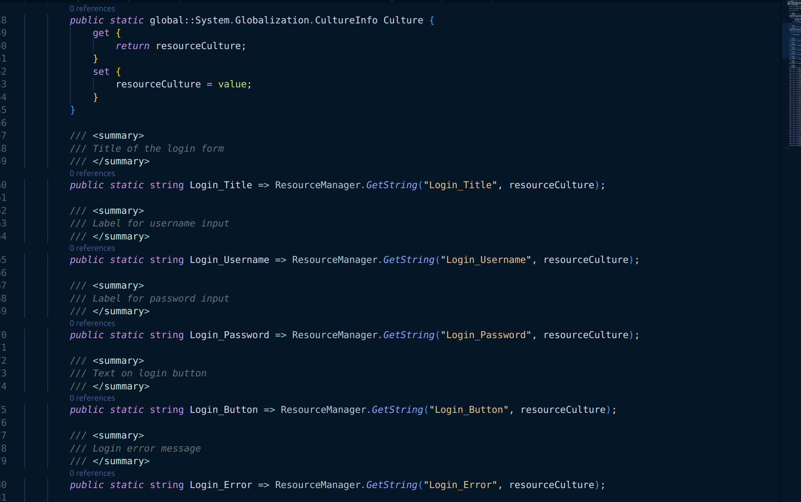
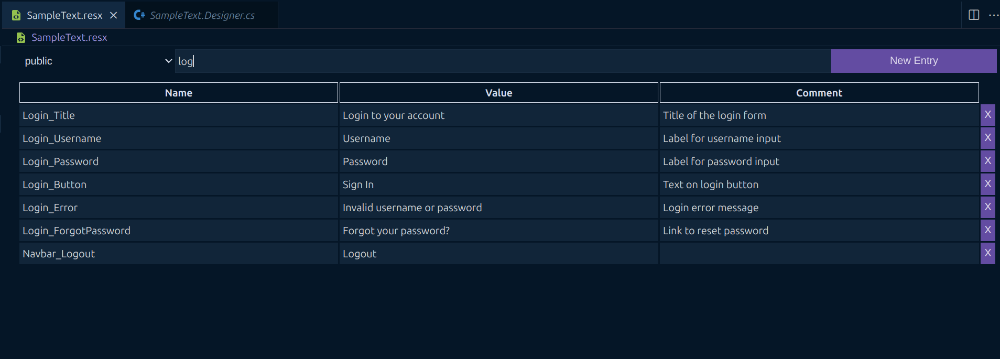

# Resource Manager

This resource manager was created as a personal learning project to explore how to build VS Code extensions. Please note that this extension is still under development, and there is no guarantee that it will work correctly with your .resx files.

## Current Features

**Manage Your Resource Entries**

You can easily create new entries using the button in the toolbar. Entry names and values can be edited directly in the table. Additionally, you can add comments to describe each resource, if needed.

**Generate a Designer File**

Whenever you save your changes, a .Designer.cs file is automatically generated in the same directory as your .resx file. This file makes it easier to access your resources in .NET projects.

**Search Your Resources**

The toolbar also includes a search bar, allowing you to quickly find specific entries. This is especially useful when working with large .resx files containing many resources.

## Roadmap

- [ ] Better error handling
- [ ] Multilanguage support

## Known Issues

There is currently no logic to prevent you from using duplicate names for your resources.

## Release Notes

### 0.0.3

Add Icon for extension.

### 0.0.2

Fixes a bug where the editor would not start when opening the extension.

### 0.0.1

Initial beta Release
